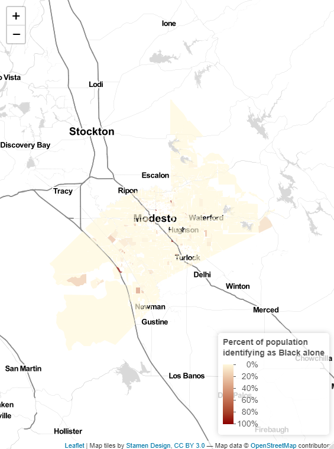
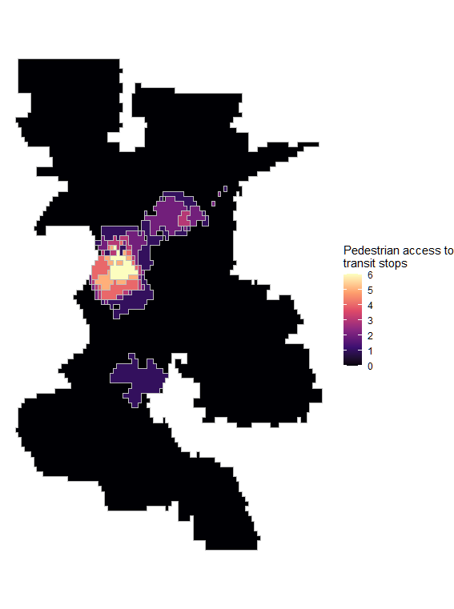
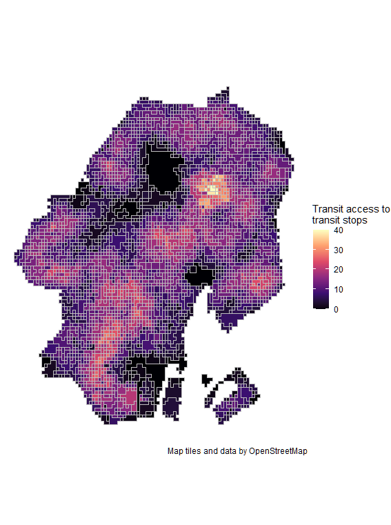

```{r setup, include=FALSE}
knitr::opts_chunk$set(echo = TRUE)
```

# Introduction

This portfolio demonstrates the following RStudio techniques:

* Displaying multiple vector layers on the same map
* Calculating and displaying relationships among point and polygon layers based on distance
* Aggregating point data to a layer of polygons
* Calculating and displaying accessibility, based on travel time
* Converting between raster layers and vector layers
* Displaying raster data on a map
* Georeferencing a raster image
* Displaying data on an interactive map


## Interactive Map
An interactive map of Stanislaus County in California. The county is known to be heavily White and Hispanic. However, I was curious about those who self-identify as black. I suspected the population would be concentrated near the larger cities like Modesto, but there are some clusters out in more rural areas like Grayson.

* Displaying data on an interactive map

[](https://fmontes22.github.io/portfolio/fullsize/inter_black.html){target="_blank"}

## Georeferencing
This map georeferences modern 2021 Signed Bike Route data over a hand-drawn 1820 map of Washington DC. Layering current bike routes data over a two century old map shows how people have altered the natural landscape to create public spaces. In this particular example, the built out landmass on the Potomatic River in the southwest corner clearly stands out.

* Georeferencing a raster image

[](https://fmontes22.github.io/portfolio/fullsize/DC.pdf){target="_blank"}

## Polygon Map
This map displays point data as polygon. Specifically, pedestrian access to transit stops in Sacramento, California. The concentration of transit stops in downtown make sense as it is the main activity hub because of the State's capitol building. 

* Aggregating point data to a layer of polygons

[](https://fmontes22.github.io/portfolio/fullsize/Polygons.pdf){target="_blank"}

## Isochrones
The map shows isochrones based on transit travel times to the nearest school in Sacramento, California.

* Displaying multiple vector layers on the same map
* Calculating and displaying accessibility, based on travel time

[](https://fmontes22.github.io/portfolio/fullsize/isochrones.pdf){target="_blank"}

## Accessibility
This map shows accessibility based on walking time to the nearest transit in Tokyo.

* Displaying multiple vector layers on the same map
* Calculating and displaying accessibility, based on travel time
* Displaying raster data on a map

[](https://fmontes22.github.io/portfolio/fullsize/Accessibility.pdf){target="_blank"}
